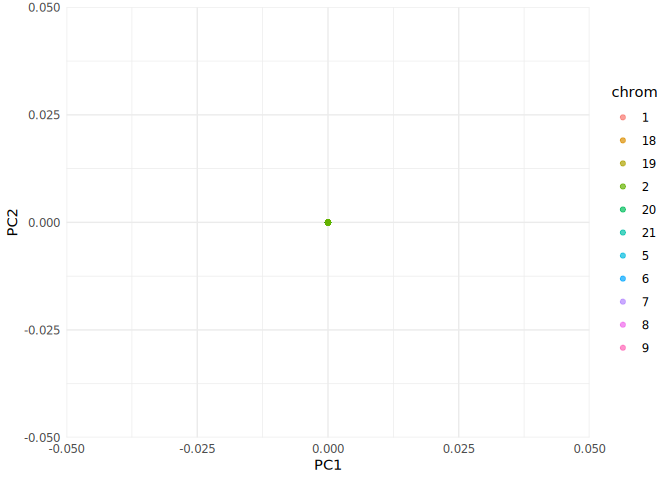

# GenomeScaleEmbeddings

## Load the package

``` r
library(GenomeScaleEmbeddings)
library(knitr)
```

## 1. Peek into remote parquet files

``` r
# Use OpenRemoteParquetView to inspect the first few rows
OpenRemoteParquetView()
#> # Source:   table<embeddings> [?? x 6]
#> # Database: DuckDB 1.4.0 [root@Linux 6.8.0-78-generic:R 4.5.1//tmp/RtmpsfGI2B/file8568a1327ea1e.duckdb]
#>    chrom pos       ref_UKB alt_UKB rsid       embedding    
#>    <chr> <chr>     <chr>   <chr>   <chr>      <list>       
#>  1 5     148899362 T       G       rs4705280  <dbl [3,072]>
#>  2 5     148899764 C       T       rs6872985  <dbl [3,072]>
#>  3 5     148900624 C       A       rs1181141  <dbl [3,072]>
#>  4 5     148901339 C       T       rs1181139  <dbl [3,072]>
#>  5 5     148902146 G       T       rs4705282  <dbl [3,072]>
#>  6 5     148902250 G       A       rs10036926 <dbl [3,072]>
#>  7 5     148903759 C       T       rs17108911 <dbl [3,072]>
#>  8 5     148904179 C       A       rs1181137  <dbl [3,072]>
#>  9 5     148904381 T       G       rs4705283  <dbl [3,072]>
#> 10 5     148906034 C       T       rs1181135  <dbl [3,072]>
#> # ℹ more rows
```

## 2. Copy remote parquet files into local DuckDB

``` r
system.time(

CopyParquetToDuckDB(db_path = "local_embeddings.duckdb", overwrite = FALSE)
)
#> Copied parquet files to DuckDB table 'embeddings' in database 'local_embeddings.duckdb'.
#>    user  system elapsed 
#>  69.253  24.612 112.208
file.info("local_embeddings.duckdb")$size
#> [1] 12128628736
```

## 3. Write embeddings to houba mmatrix

``` r
system.time(

houba <- writeEmbeddingsHoubaFromDuckDB(dbPath = "local_embeddings.duckdb", overwrite = FALSE)
)
#> Writing 616386 rows in batches of 100000...
#> Warning in writeEmbeddingsHoubaFromDuckDB(dbPath = "local_embeddings.duckdb", :
#> Embedding file already exists: local_embeddings.houba. Use overwrite = TRUE to
#> overwrite.
#> Done writing embeddings and info to houba mmatrix.
#>    user  system elapsed 
#>   0.504   0.050   0.511
file.info("local_embeddings.houba")$size
#> [1] 15148302336
```

## 4. Run PCA on houba mmatrix

``` r
system.time(
  pca_res <- houbaPCA("local_embeddings.houba")
)
#> Attached big.matrix from descriptor file: local_embeddings.houba.desc
#> Dimensions: 616386 x 3072
#> Running PCA with center=TRUE, scale=TRUE, ncomp=15
#>    user  system elapsed 
#> 326.543 111.688  39.725
```

## 5. Get PCA scores

``` r
pc_scores <- getPcaScores(pca_res)
object.size(pc_scores)
#> 73966536 bytes
```

## 6. Plot PCA dimensions (PC1 vs PC2, colored by chromosome)

``` r
plotPcaDims(pc_scores, houba$info, annotation_col = "chrom", dim1 = 1, dim2 = 2)
```



## 7. Print spatial correlations (PC1 vs genomic position, by chromosome)

``` r
cor_table <- data.frame(
  Chromosome = unique(houba$info$chrom),
  Correlation = NA,
  P_value = NA
)
for (i in seq_along(cor_table$Chromosome)) {
  chr <- cor_table$Chromosome[i]
  idx <- houba$info$chrom == chr
  pos_numeric <- as.numeric(as.character(houba$info$pos[idx]))
  pc1 <- pc_scores[idx, 1]
  # Use differences
  d_pc1 <- abs(diff(pc1))
  d_pos <- abs(diff(pos_numeric))
  ct <- cor.test(d_pc1, d_pos, use = "complete.obs")
  cor_table$Correlation[i] <- ct$estimate
  cor_table$P_value[i] <- ct$p.value
}
#> Warning in cor(x, y): the standard deviation is zero
#> Warning in cor(x, y): the standard deviation is zero
#> Warning in cor(x, y): the standard deviation is zero
#> Warning in cor(x, y): the standard deviation is zero
#> Warning in cor(x, y): the standard deviation is zero
#> Warning in cor(x, y): the standard deviation is zero
#> Warning in cor(x, y): the standard deviation is zero
#> Warning in cor(x, y): the standard deviation is zero
#> Warning in cor(x, y): the standard deviation is zero
#> Warning in cor(x, y): the standard deviation is zero
#> Warning in cor(x, y): the standard deviation is zero
kable(cor_table, digits = 4, caption = "Correlation (and p-value) between PC1 and Genomic Position differences by Chromosome")
```

| Chromosome | Correlation | P_value |
|:-----------|------------:|--------:|
| 5          |          NA |      NA |
| 6          |          NA |      NA |
| 7          |          NA |      NA |
| 8          |          NA |      NA |
| 9          |          NA |      NA |
| 1          |          NA |      NA |
| 18         |          NA |      NA |
| 19         |          NA |      NA |
| 20         |          NA |      NA |
| 2          |          NA |      NA |
| 21         |          NA |      NA |

Correlation (and p-value) between PC1 and Genomic Position differences
by Chromosome

------------------------------------------------------------------------

- All file sizes are displayed after each step for transparency.
- Remote parquet files are previewed before local processing.
- For large datasets, consider subsampling for faster plotting.
- Use `overwrite = FALSE` for DuckDB and houba steps to avoid slow
  download and reuse existing files.
