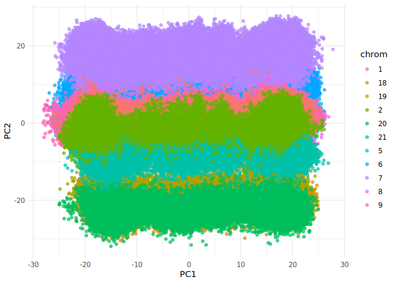

# GenomeScaleEmbeddings

## Load the package

``` r
library(GenomeScaleEmbeddings)
library(knitr)
library(httr2)
library(jsonlite)
library(dplyr)
#> 
#> Attaching package: 'dplyr'
#> The following objects are masked from 'package:stats':
#> 
#>     filter, lag
#> The following objects are masked from 'package:base':
#> 
#>     intersect, setdiff, setequal, union
library(ggplot2)
```

## 1. Peek into remote parquet files

``` r
# Use OpenRemoteParquetView to inspect the first few rows
OpenRemoteParquetView()
#> # Source:   table<embeddings> [?? x 6]
#> # Database: DuckDB 1.4.0 [root@Linux 6.8.0-78-generic:R 4.5.1//tmp/RtmphnMadB/file898f76fe60015.duckdb]
#>    chrom pos       ref_UKB alt_UKB rsid       embedding    
#>    <chr> <chr>     <chr>   <chr>   <chr>      <list>       
#>  1 5     148899362 T       G       rs4705280  <dbl [3,072]>
#>  2 5     148899764 C       T       rs6872985  <dbl [3,072]>
#>  3 5     148900624 C       A       rs1181141  <dbl [3,072]>
#>  4 5     148901339 C       T       rs1181139  <dbl [3,072]>
#>  5 5     148902146 G       T       rs4705282  <dbl [3,072]>
#>  6 5     148902250 G       A       rs10036926 <dbl [3,072]>
#>  7 5     148903759 C       T       rs17108911 <dbl [3,072]>
#>  8 5     148904179 C       A       rs1181137  <dbl [3,072]>
#>  9 5     148904381 T       G       rs4705283  <dbl [3,072]>
#> 10 5     148906034 C       T       rs1181135  <dbl [3,072]>
#> # ℹ more rows
```

## 2. Copy remote parquet files into local DuckDB

``` r
system.time(

CopyParquetToDuckDB(db_path = "local_embeddings.duckdb", overwrite = FALSE)
)
#> Database file 'local_embeddings.duckdb' already exists. Skipping copy.
#>    user  system elapsed 
#>   0.034   0.003   0.029
file.info("local_embeddings.duckdb")$size
#> [1] 12106084352
```

## 3. Write embeddings to houba mmatrix

``` r
system.time(

houba <- writeEmbeddingsHoubaFromDuckDB(dbPath = "local_embeddings.duckdb", 
overwrite = FALSE)
)
#> Warning in mk.descriptor.file(object@file, object@dim[1], object@dim[2], :
#> local_embeddings.houba.desc already exists.
#> Using existing houba file and info data.
#>    user  system elapsed 
#>   0.556   0.048   0.567
houba
#> Houba mmatrix file: local_embeddings.houba 
#> Embeddings (houba::mmatrix):
#> A read-only mmatrix with 616386 rows and 3072 cols
#> data type:  double 
#> File: local_embeddings.houba 
#> --- excerpt
#>              [,1]       [,2]        [,3]         [,4]         [,5]
#> [1,] -0.008660397 0.02568399 -0.01839902 -0.001554275 -0.014016987
#> [2,] -0.003067377 0.01635006 -0.02215753  0.003889058 -0.013320981
#> [3,] -0.002486568 0.04113422 -0.01771097  0.024944620 -0.022576459
#> [4,] -0.002763281 0.02626457 -0.01791935  0.010160015 -0.011453237
#> [5,] -0.013722803 0.02826897 -0.01959616 -0.005454814 -0.009612823
#> 
#> Info data.frame (first 10 rows):
#>    chrom       pos ref_UKB alt_UKB       rsid
#> 1      5 148899362       T       G  rs4705280
#> 2      5 148899764       C       T  rs6872985
#> 3      5 148900624       C       A  rs1181141
#> 4      5 148901339       C       T  rs1181139
#> 5      5 148902146       G       T  rs4705282
#> 6      5 148902250       G       A rs10036926
#> 7      5 148903759       C       T rs17108911
#> 8      5 148904179       C       A  rs1181137
#> 9      5 148904381       T       G  rs4705283
#> 10     5 148906034       C       T  rs1181135
file.info("local_embeddings.houba")$size
#> [1] 15148302336
```

## 4. Run PCA on houba mmatrix

``` r
system.time(
  pca_res <- houbaPCA("local_embeddings.houba")
)
#> Attached big.matrix from descriptor file: local_embeddings.houba.desc
#> Dimensions: 616386 x 3072
#> Running PCA with center=TRUE, scale=TRUE, ncomp=15
#>    user  system elapsed 
#> 361.521 117.614  55.178
```

## 5. Get PCA scores

``` r
pc_scores <- getPcaScores(pca_res)
object.size(pc_scores)
#> 73966536 bytes
```

## 6. Plot PCA dimensions (PC1 vs PC2, colored by chromosome)

``` r
plotPcaDims(pc_scores, houba$info, annotation_col = "chrom", dim1 = 1, dim2 = 2)
```



## 7. Annotate variants with coffee consumption GWAS and plot PC1 vs PC2 by gene

``` r
# Fetch coffee consumption Phenotype data
query <- utils::URLencode("https://rest.ensembl.org/phenotype/term/homo_sapiens/coffee consumption")
resp <- request(query) |>
  req_headers("Content-Type" = "application/json") |>
  req_perform()

coffee_json <- resp_body_json(resp)

# Extract rsid and gene annotation
coffee_anno <- lapply(coffee_json, function(x) {
  if (!is.null(x$Variation)) {
    data.frame(
      rsid = x$Variation,
      gen = if (!is.null(x$attributes$associated_gene)) x$attributes$associated_gene else NA,
      stringsAsFactors = FALSE
    )
  }
}) |> bind_rows()

# Fetch Preeclampsia Phenotype data
query_preeclampsia <- utils::URLencode("https://rest.ensembl.org/phenotype/term/homo_sapiens/preeclampsia")
resp_preeclampsia <- request(query_preeclampsia) |>
  req_headers("Content-Type" = "application/json") |>
  req_perform()
preeclampsia_json <- resp_body_json(resp_preeclampsia)

# Extract rsid and gene annotation for Preeclampsia
preeclampsia_anno <- lapply(preeclampsia_json, function(x) {
  if (!is.null(x$Variation)) {
    data.frame(
      rsid = x$Variation,
      gen = if (!is.null(x$attributes$associated_gene)) x$attributes$associated_gene else NA,
      stringsAsFactors = FALSE
    )
  }
}) |> bind_rows()

# Merge PCA scores and houba info
plotDf <- cbind(pc_scores,houba$info)
names(plotDf)[1:15] <- paste0("PC",1:15)

# Annotate plotDf with coffee and preeclampsia
plotDf <- plotDf |>
  left_join(coffee_anno, by = c("rsid" = "rsid")) |>
  left_join(preeclampsia_anno, by = c("rsid" = "rsid"), suffix = c("_coffee", "_preeclampsia"))

# Subset for coffee and preeclampsia SNPs
coffee_snps <- subset(plotDf, !is.na(gen_coffee))
preeclampsia_snps <- subset(plotDf, !is.na(gen_preeclampsia))

preeclampsia_snps
#>               PC1          PC2         PC3        PC4       PC5        PC6
#> 217863  20.332288  18.55574589 -14.4735637 -10.991239 12.453593 -0.5138648
#> 217864  20.332288  18.55574589 -14.4735637 -10.991239 12.453593 -0.5138648
#> 297501  18.868638  -2.88021375 -14.0778072  13.469891 -3.580378  1.1745966
#> 297502  18.868638  -2.88021375 -14.0778072  13.469891 -3.580378  1.1745966
#> 407537  13.709633   0.06253137  -7.8579262   2.150449  6.938243 15.4355823
#> 407538  13.709633   0.06253137  -7.8579262   2.150449  6.938243 15.4355823
#> 407603 -19.890486  -5.10062916  -6.6152805  -2.146478  7.622486 23.2970606
#> 407604 -19.890486  -5.10062916  -6.6152805  -2.146478  7.622486 23.2970606
#> 535496  -4.064043 -20.75579426   2.8951512 -12.193071 15.470846 -5.0249177
#> 535497  -4.064043 -20.75579426   2.8951512 -12.193071 15.470846 -5.0249177
#> 536935  19.726423 -24.73503187   1.6028620  -4.490019 15.422780 -6.5282116
#> 536936  19.726423 -24.73503187   1.6028620  -4.490019 15.422780 -6.5282116
#> 608649 -13.270446  -8.42245739  -0.2394918  -9.403489 12.054130 13.5463940
#> 608650 -13.270446  -8.42245739  -0.2394918  -9.403489 12.054130 13.5463940
#>              PC7       PC8        PC9      PC10       PC11       PC12
#> 217863 -1.312922 -5.685146  1.4221963  9.025187  1.7242048  6.8596845
#> 217864 -1.312922 -5.685146  1.4221963  9.025187  1.7242048  6.8596845
#> 297501 -3.749894  7.432838  7.0972691  8.721322  2.8150465  0.4063969
#> 297502 -3.749894  7.432838  7.0972691  8.721322  2.8150465  0.4063969
#> 407537 16.313487  2.301157 -0.2792026 -5.285918 -5.4615565  5.8645450
#> 407538 16.313487  2.301157 -0.2792026 -5.285918 -5.4615565  5.8645450
#> 407603 16.213088  2.453817 -2.9957180 -2.488456  0.9310971  1.0066981
#> 407604 16.213088  2.453817 -2.9957180 -2.488456  0.9310971  1.0066981
#> 535496 -1.775855 14.639664  2.0040042 -2.618456 -8.7974176 -2.3443682
#> 535497 -1.775855 14.639664  2.0040042 -2.618456 -8.7974176 -2.3443682
#> 536935 -3.523934 19.364702  0.1634817  1.727659 -0.9391506  8.8937352
#> 536936 -3.523934 19.364702  0.1634817  1.727659 -0.9391506  8.8937352
#> 608649 -2.921489  1.126489  0.8121234 -1.930809 -0.1644902 -2.5545299
#> 608650 -2.921489  1.126489  0.8121234 -1.930809 -0.1644902 -2.5545299
#>               PC13      PC14       PC15 chrom       pos ref_UKB alt_UKB
#> 217863  0.60796663  2.356136  -4.355530     7  25573041       A       G
#> 217864  0.60796663  2.356136  -4.355530     7  25573041       A       G
#> 297501  5.86293584 -1.118851  -1.186786     8  20389247       A       G
#> 297502  5.86293584 -1.118851  -1.186786     8  20389247       A       G
#> 407537 -6.09999925  1.572024  -2.803861     9 100046403       G       A
#> 407538 -6.09999925  1.572024  -2.803861     9 100046403       G       A
#> 407603  0.07612659 -1.183891   2.193446     9 100214259       C       T
#> 407604  0.07612659 -1.183891   2.193446     9 100214259       C       T
#> 535496 -5.44755469  1.836263   4.246662    20   4234910       C       T
#> 535497 -5.44755469  1.836263   4.246662    20   4234910       C       T
#> 536935 -6.35812850 -3.324299   3.036637    20   5968888       A       G
#> 536936 -6.35812850 -3.324299   3.036637    20   5968888       A       G
#> 608649 -1.02416068 24.589802 -11.807756    21  34835765       C       T
#> 608650 -1.02416068 24.589802 -11.807756    21  34835765       C       T
#>              rsid gen_coffee gen_preeclampsia
#> 217863   rs975369       <NA>             NPVF
#> 217864   rs975369       <NA>             NPVF
#> 297501 rs17412740       <NA>            LZTS1
#> 297502 rs17412740       <NA>            LZTS1
#> 407537  rs7028939       <NA>            ERP44
#> 407538  rs7028939       <NA>            ERP44
#> 407603 rs10989019       <NA>             INVS
#> 407604 rs10989019       <NA>             INVS
#> 535496  rs1556832       <NA>           ADRA1D
#> 535497  rs1556832       <NA>           ADRA1D
#> 536935  rs4815879       <NA>             MCM8
#> 536936  rs4815879       <NA>             MCM8
#> 608649  rs9976946       <NA>            RUNX1
#> 608650  rs9976946       <NA>            RUNX1
ggplot() +
  geom_point(data = coffee_snps, aes(x = PC1, y = PC2, color = gen_coffee), shape = 16, size = 2, alpha = 0.7) +
  geom_point(data = preeclampsia_snps, aes(x = PC1, y = PC2, color = gen_preeclampsia), shape = 17, size = 3, alpha = 0.7) +
  labs(title = "PC1 vs PC2: coffee SNPs (circles) and preeclampsia SNPs (triangles)", color = "Gene annotation") +
  theme_minimal()
```


------------------------------------------------------------------------

- All file sizes are displayed after each step for transparency.
- Remote parquet files are previewed before local processing.
- For large datasets, consider subsampling for faster plotting.
- Use `overwrite = FALSE` for DuckDB and houba steps to avoid slow
  download and reuse existing files.
