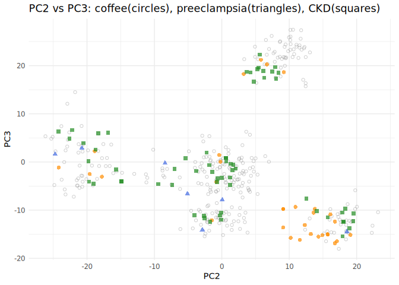
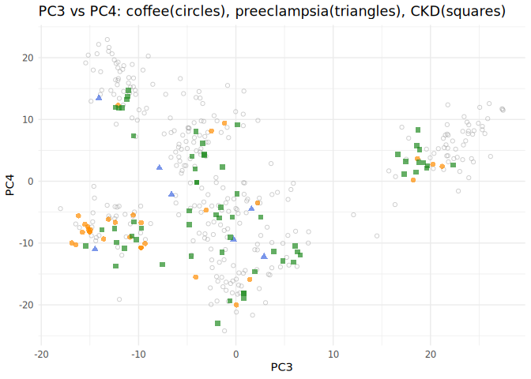

# GenomeScaleEmbeddings

We explore the SNP-level LLM embeddings from the paper “**Incorporating
LLM Embeddings for Variation Across the Human Genome**”
([arXiv:2509.20702v1](https://arxiv.org/html/2509.20702v1)). We use
`duckdb` to download the embeddings from huggingFace , save them in
[`houba`](https://github.com/HervePerdry/houba) memory-mapped matrices,
and use [`bigPCACpp`](https://github.com/fbertran/bigPCAcpp/) to perform
PCA and some explorations. Please note that these embeddings look to be
half of what is announced in the paper due to huggingFace limits.

## Load the packages

``` r
library(GenomeScaleEmbeddings)
library(knitr)
library(httr2)
library(jsonlite)
library(dplyr)
library(ggplot2)
```

## Peek into remote parquet files

``` r
# Use OpenRemoteParquetView to inspect the first few rows
OpenRemoteParquetView()
#> # Source:   table<embeddings> [?? x 6]
#> # Database: DuckDB 1.4.0 [root@Linux 6.8.0-78-generic:R 4.5.1//tmp/RtmpfA27mt/file8e4d24b77365f.duckdb]
#>    chrom pos       ref_UKB alt_UKB rsid       embedding    
#>    <chr> <chr>     <chr>   <chr>   <chr>      <list>       
#>  1 5     148899362 T       G       rs4705280  <dbl [3,072]>
#>  2 5     148899764 C       T       rs6872985  <dbl [3,072]>
#>  3 5     148900624 C       A       rs1181141  <dbl [3,072]>
#>  4 5     148901339 C       T       rs1181139  <dbl [3,072]>
#>  5 5     148902146 G       T       rs4705282  <dbl [3,072]>
#>  6 5     148902250 G       A       rs10036926 <dbl [3,072]>
#>  7 5     148903759 C       T       rs17108911 <dbl [3,072]>
#>  8 5     148904179 C       A       rs1181137  <dbl [3,072]>
#>  9 5     148904381 T       G       rs4705283  <dbl [3,072]>
#> 10 5     148906034 C       T       rs1181135  <dbl [3,072]>
#> # ℹ more rows
```

## Copy remote parquet files into local DuckDB

``` r
system.time(
{
# can comment this out to skip these
unlink("local_embeddings.duckdb")
CopyParquetToDuckDB(db_path = "local_embeddings.duckdb", overwrite = FALSE)
})
#> Copied parquet files to DuckDB table 'embeddings' in database 'local_embeddings.duckdb'.
#>    user  system elapsed 
#>  75.998  23.974 107.257
file.info("local_embeddings.duckdb")$size
#> [1] 12106084352
```

## Write embeddings to houba mmatrix

``` r
system.time({
unlink("local_embeddings.houba")
houba <- writeEmbeddingsHoubaFromDuckDB(dbPath = "local_embeddings.duckdb", 
overwrite = FALSE)
})
#> Warning in mk.descriptor.file(object@file, object@dim[1], object@dim[2], :
#> local_embeddings.houba.desc already exists.
#> Writing 616386 rows in batches of 100000...
#> Processed rows 1 to 100000
#> Processed rows 100001 to 200000
#> Processed rows 200001 to 300000
#> Processed rows 300001 to 400000
#> Processed rows 400001 to 500000
#> Processed rows 500001 to 600000
#> Processed rows 600001 to 616386
#> Done writing embeddings and info to houba mmatrix.
#>    user  system elapsed 
#>  36.360  22.685  48.050
houba
#> Houba mmatrix file: local_embeddings.houba 
#> Embeddings (houba::mmatrix):
#> A mmatrix with 616386 rows and 3072 cols
#> data type:  double 
#> File: local_embeddings.houba 
#> --- excerpt
#>              [,1]       [,2]        [,3]         [,4]         [,5]
#> [1,] -0.008660397 0.02568399 -0.01839902 -0.001554275 -0.014016987
#> [2,] -0.003067377 0.01635006 -0.02215753  0.003889058 -0.013320981
#> [3,] -0.002486568 0.04113422 -0.01771097  0.024944620 -0.022576459
#> [4,] -0.002763281 0.02626457 -0.01791935  0.010160015 -0.011453237
#> [5,] -0.013722803 0.02826897 -0.01959616 -0.005454814 -0.009612823
#> 
#> Info data.frame (first 10 rows):
#>    chrom       pos ref_UKB alt_UKB       rsid
#> 1      5 148899362       T       G  rs4705280
#> 2      5 148899764       C       T  rs6872985
#> 3      5 148900624       C       A  rs1181141
#> 4      5 148901339       C       T  rs1181139
#> 5      5 148902146       G       T  rs4705282
#> 6      5 148902250       G       A rs10036926
#> 7      5 148903759       C       T rs17108911
#> 8      5 148904179       C       A  rs1181137
#> 9      5 148904381       T       G  rs4705283
#> 10     5 148906034       C       T  rs1181135
file.info("local_embeddings.houba")$size
#> [1] 15148302336
```

## Run PCA on houba mmatrix

``` r
system.time(
  pca_res <- houbaPCA("local_embeddings.houba")
)
#> Attached big.matrix from descriptor file: local_embeddings.houba.desc
#> Dimensions: 616386 x 3072
#> Running PCA with center=TRUE, scale=TRUE, ncomp=15
#>    user  system elapsed 
#> 370.177 123.801  56.700
```

## Get PCA scores

``` r
pc_scores <- getPcaScores(pca_res)
object.size(pc_scores)
#> 73966536 bytes
```

## Plot PCA dimensions (colored by chromosome)

``` r
plotPcaDims(pc_scores, houba$info, annotation_col = "chrom", dim1 = 1, dim2 = 2)
```


``` r
plotPcaDims(pc_scores, houba$info, annotation_col = "chrom", dim1 = 2, dim2 = 3)
```


``` r
plotPcaDims(pc_scores, houba$info, annotation_col = "chrom", dim1 = 3, dim2 = 4)
```


## Annotate variants from ensembl phenotype endpoint plot in the PCA spaces

``` r
# Helper function to fetch and extract annotation
gen_phenotype_anno <- function(phenotype_term) {
  query <- utils::URLencode(paste0("https://rest.ensembl.org/phenotype/term/homo_sapiens/", phenotype_term))
  resp <- request(query) |>
    req_headers("Content-Type" = "application/json") |>
    req_perform()
  json <- resp_body_json(resp)
  lapply(json, function(x) {
    if (!is.null(x$Variation)) {
      data.frame(
        rsid = x$Variation,
        gen = if (!is.null(x$attributes$associated_gene)) x$attributes$associated_gene else NA,
        stringsAsFactors = FALSE
      )
    }
  }) |> bind_rows()
}

# Fetch annotation data frames using helper function
coffee_anno <- gen_phenotype_anno("coffee consumption")
preeclampsia_anno <- gen_phenotype_anno("preeclampsia")
ckd_anno <- gen_phenotype_anno("chronic kidney disease") |> rename(gen_ckd = gen)

# Merge PCA scores and houba info
plotDf <- cbind(pc_scores,houba$info)
names(plotDf)[1:15] <- paste0("PC",1:15)

# Annotate plotDf with coffee, preeclampsia, and CKD
plotDf <- plotDf |>
  left_join(coffee_anno, by = c("rsid" = "rsid")) |>
  left_join(preeclampsia_anno, by = c("rsid" = "rsid"), suffix = c("_coffee", "_preeclampsia")) |>
  left_join(ckd_anno, by = c("rsid" = "rsid"), suffix = c("", "_ckd"))

# Subset for coffee, preeclampsia, and CKD SNPs
coffee_snps <- subset(plotDf, !is.na(gen_coffee))|>
        unique()
preeclampsia_snps <- subset(plotDf, !is.na(gen_preeclampsia))|>
        unique()
ckd_snps <- subset(plotDf, !is.na(gen_ckd)) |>
        unique()

# Plot: coffee SNPs as circles, preeclampsia SNPs as triangles, CKD SNPs as squares
plot_pc_pair <- function(pc_x, pc_y, title) {
  # Identify background SNPs
  bg_snps <- plotDf[
    is.na(plotDf$gen_coffee) & is.na(plotDf$gen_preeclampsia) & is.na(plotDf$gen_ckd),
  ]
  set.seed(1995)
  bg_sample <- if (nrow(bg_snps) > 300) bg_snps[sample(nrow(bg_snps), 300), ] else bg_snps

  ggplot() +
    geom_point(data = bg_sample, aes(x = .data[[pc_x]], y = .data[[pc_y]]), color = "grey60", shape = 1, size = 1.5, alpha = 0.5) +
    geom_point(data = coffee_snps, aes(x = .data[[pc_x]], y = .data[[pc_y]]), color = "darkorange", shape = 16, size = 2, alpha = 0.7) +
    geom_point(data = preeclampsia_snps, aes(x = .data[[pc_x]], y = .data[[pc_y]]), color = "royalblue", shape = 17, size = 2, alpha = 0.7) +
    geom_point(data = ckd_snps, aes(x = .data[[pc_x]], y = .data[[pc_y]]), color = "forestgreen", shape = 15, size = 2, alpha = 0.7) +
    labs(title = title, x = pc_x, y = pc_y) +
    theme_minimal() +
    theme(legend.position = "none")
}
plot_pc_pair("PC1", "PC2", "PC1 vs PC2: coffee(circles), preeclampsia(triangles), CKD(squares) ")
```


``` r
plot_pc_pair("PC2", "PC3", "PC2 vs PC3: coffee(circles), preeclampsia(triangles), CKD(squares)")
```



``` r
plot_pc_pair("PC3", "PC4", "PC3 vs PC4: coffee(circles), preeclampsia(triangles), CKD(squares)")
```



## Notes

- All file sizes are displayed after each step for transparency.
- Remote parquet files are previewed before local processing.
- For large datasets, consider subsampling for faster plotting.
- Use `overwrite = FALSE` for DuckDB and houba steps to avoid slow
  download and reuse existing files.

## References

- The embeddings explored here were published by the workers of the
  paper **Incorporating LLM Embeddings for Variation Across the Human
  Genome** ([arXiv:2509.20702v1](https://arxiv.org/html/2509.20702v1))
